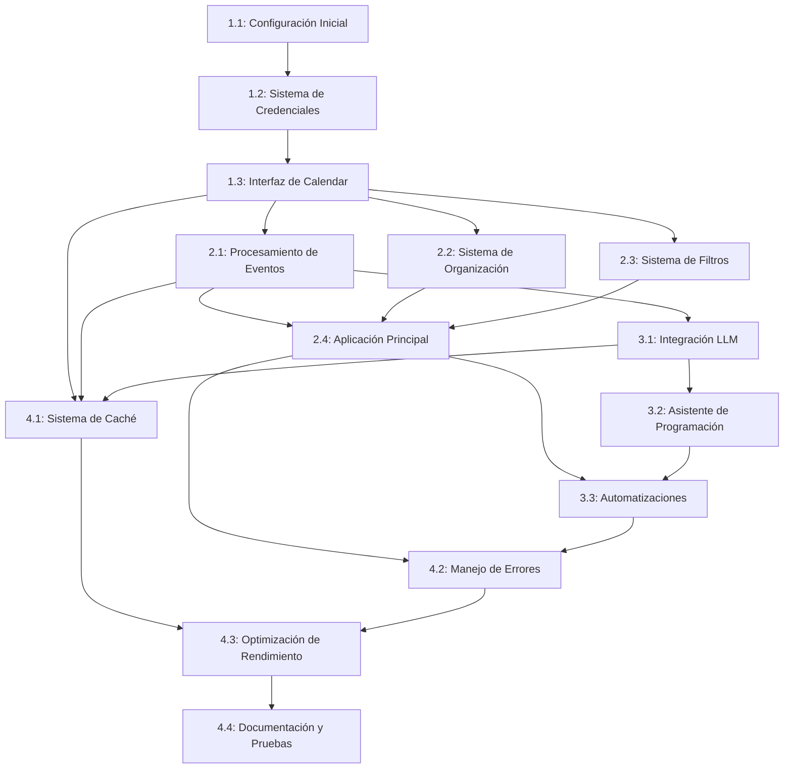

# Implementation Plan: Calendar AI Bot

Este documento detalla el plan de implementación para el proyecto `calendar-ai-bot`. Cada fase contiene tareas específicas con sus correspondientes pruebas. **No se debe avanzar a la siguiente tarea sin haber pasado todas las pruebas de la tarea actual.**

## Fase 1: Estructura Base y Autenticación

### Tarea 1.1: Configuración Inicial del Proyecto

**Descripción:** Establecer la estructura básica del proyecto y configurar el entorno de desarrollo.

**Implementación:**

- [ ] Crear estructura de directorios
- [ ] Configurar archivos iniciales (setup.py, requirements.txt, etc.)
- [ ] Configurar entorno virtual
- [ ] Establecer configuración básica

**Pruebas:**

- [ ] `test_project_structure`: Verificar que la estructura de directorios es correcta
- [ ] `test_environment_setup`: Verificar que el entorno virtual funciona correctamente
- [ ] `test_configuration_loading`: Verificar que la configuración se carga correctamente

### Tarea 1.2: Implementar Sistema de Credenciales

**Descripción:** Adaptar el sistema de credenciales existente para su uso con Google Calendar API.

**Implementación:**

- [ ] Adaptar `utils/credentials.py` para acceso a Calendar API
- [ ] Implementar manejo de tokens y autenticación
- [ ] Configurar permisos específicos para Calendar

**Pruebas:**

- [ ] `test_credential_loading`: Verificar carga correcta de credenciales
- [ ] `test_token_refresh`: Verificar renovación automática de tokens
- [ ] `test_permission_validation`: Verificar que los permisos son correctos para Calendar API
- [ ] `test_error_handling`: Verificar manejo de errores de autenticación

### Tarea 1.3: Implementar Interfaz Básica de Calendar

**Descripción:** Crear una interfaz robusta para interactuar con Google Calendar API.

**Implementación:**

- [ ] Crear clase `CalendarInterface` en `calendar/interface.py`
- [ ] Implementar métodos para operaciones CRUD básicas de eventos
- [ ] Añadir manejo de errores específicos para Calendar API

**Pruebas:**

- [ ] `test_calendar_authentication`: Verificar autenticación correcta con Calendar API
- [ ] `test_list_calendars`: Verificar listado de calendarios disponibles
- [ ] `test_list_events`: Verificar listado de eventos
- [ ] `test_get_event`: Verificar obtención de evento específico
- [ ] `test_create_event`: Verificar creación de eventos
- [ ] `test_update_event`: Verificar actualización de eventos
- [ ] `test_delete_event`: Verificar eliminación de eventos
- [ ] `test_error_handling`: Verificar manejo de errores de API

## Fase 2: Funcionalidades Principales

### Tarea 2.1: Implementar Procesamiento de Eventos

**Descripción:** Desarrollar la lógica para procesar eventos del calendario.

**Implementación:**

- [ ] Crear clase `EventProcessor` en `calendar/processor.py`
- [ ] Implementar análisis de eventos (duración, participantes, recurrencia)
- [ ] Añadir funciones para extraer información clave de eventos
- [ ] Implementar detección de conflictos de horarios

**Pruebas:**

- [ ] `test_processor_initialization`: Verificar inicialización correcta del procesador
- [ ] `test_event_analysis`: Verificar análisis correcto de eventos
- [ ] `test_extract_event_details`: Verificar extracción de detalles de eventos
- [ ] `test_detect_conflicts`: Verificar detección de conflictos de horarios
- [ ] `test_recurring_events`: Verificar procesamiento de eventos recurrentes
- [ ] `test_processor_error_handling`: Verificar manejo de errores en procesamiento

### Tarea 2.2: Implementar Sistema de Organización

**Descripción:** Crear un sistema para organizar eventos automáticamente.

**Implementación:**

- [ ] Crear clase `EventOrganizer` en `calendar/organizer.py`
- [ ] Implementar métodos para categorizar eventos
- [ ] Añadir funciones para optimizar horarios
- [ ] Implementar reglas de organización configurables

**Pruebas:**

- [ ] `test_organizer_initialization`: Verificar inicialización correcta del organizador
- [ ] `test_event_categorization`: Verificar categorización correcta de eventos
- [ ] `test_schedule_optimization`: Verificar optimización de horarios
- [ ] `test_free_time_identification`: Verificar identificación de tiempo libre
- [ ] `test_custom_rules`: Verificar aplicación de reglas personalizadas
- [ ] `test_organizer_error_handling`: Verificar manejo de errores en organización

### Tarea 2.3: Implementar Sistema de Filtros

**Descripción:** Crear un sistema de filtros para seleccionar eventos según criterios específicos.

**Implementación:**

- [ ] Crear módulo `calendar/filters.py` con clases para filtrado
- [ ] Implementar filtros por título, participantes, fecha, duración
- [ ] Añadir sistema de reglas personalizables
- [ ] Implementar combinación de filtros

**Pruebas:**

- [ ] `test_filter_by_title`: Verificar filtrado por título
- [ ] `test_filter_by_participants`: Verificar filtrado por participantes
- [ ] `test_filter_by_date`: Verificar filtrado por fecha
- [ ] `test_filter_by_duration`: Verificar filtrado por duración
- [ ] `test_filter_combination`: Verificar combinación de múltiples filtros
- [ ] `test_custom_filter_rules`: Verificar reglas de filtrado personalizadas
- [ ] `test_filter_error_handling`: Verificar manejo de errores en filtrado

### Tarea 2.4: Implementar Aplicación Principal

**Descripción:** Crear la aplicación principal que integra todos los componentes.

**Implementación:**

- [ ] Crear `app.py` con la lógica principal
- [ ] Implementar monitoreo de cambios en Calendar
- [ ] Añadir procesamiento automático de eventos nuevos
- [ ] Implementar manejo de señales y cierre graceful

**Pruebas:**

- [ ] `test_app_initialization`: Verificar inicialización correcta de la aplicación
- [ ] `test_config_loading`: Verificar carga correcta de configuración
- [ ] `test_calendar_monitoring`: Verificar monitoreo correcto de cambios en Calendar
- [ ] `test_event_processing_workflow`: Verificar flujo completo de procesamiento
- [ ] `test_graceful_shutdown`: Verificar cierre correcto de la aplicación
- [ ] `test_error_recovery`: Verificar recuperación tras errores
- [ ] `test_logging`: Verificar funcionamiento del sistema de logging

## Fase 3: Integración con LLM y Funcionalidades Avanzadas

### Tarea 3.1: Integrar LLM para Análisis de Eventos

**Descripción:** Adaptar el cliente LLM para el procesamiento de eventos del calendario.

**Implementación:**

- [ ] Adaptar `llm/client.py` para análisis de eventos
- [ ] Implementar prompts específicos para diferentes tipos de eventos
- [ ] Añadir extracción de información contextual
- [ ] Implementar generación de resúmenes de agenda

**Pruebas:**

- [ ] `test_llm_client_initialization`: Verificar inicialización correcta del cliente LLM
- [ ] `test_event_analysis`: Verificar análisis correcto de eventos
- [ ] `test_context_extraction`: Verificar extracción de información contextual
- [ ] `test_agenda_summary`: Verificar generación de resúmenes de agenda
- [ ] `test_llm_error_handling`: Verificar manejo de errores en LLM
- [ ] `test_llm_caching`: Verificar funcionamiento del caché

### Tarea 3.2: Implementar Asistente de Programación

**Descripción:** Crear un asistente inteligente para programar eventos.

**Implementación:**

- [ ] Crear módulo para análisis de disponibilidad
- [ ] Implementar sugerencias de horarios óptimos
- [ ] Añadir sistema de resolución de conflictos
- [ ] Implementar programación automática basada en preferencias

**Pruebas:**

- [ ] `test_availability_analysis`: Verificar análisis correcto de disponibilidad
- [ ] `test_optimal_time_suggestion`: Verificar sugerencias de horarios óptimos
- [ ] `test_conflict_resolution`: Verificar resolución de conflictos
- [ ] `test_automatic_scheduling`: Verificar programación automática
- [ ] `test_preference_based_scheduling`: Verificar programación basada en preferencias
- [ ] `test_scheduling_error_handling`: Verificar manejo de errores en programación

### Tarea 3.3: Implementar Automatizaciones

**Descripción:** Crear un sistema de reglas para procesamiento automático de eventos.

**Implementación:**

- [ ] Crear sistema de reglas configurables
- [ ] Implementar acciones basadas en eventos del calendario
- [ ] Añadir flujos de trabajo personalizables
- [ ] Implementar notificaciones y recordatorios inteligentes

**Pruebas:**

- [ ] `test_rule_configuration`: Verificar configuración correcta de reglas
- [ ] `test_event_detection`: Verificar detección de eventos
- [ ] `test_action_execution`: Verificar ejecución de acciones
- [ ] `test_workflow_execution`: Verificar ejecución de flujos de trabajo
- [ ] `test_notification_system`: Verificar sistema de notificaciones
- [ ] `test_smart_reminders`: Verificar recordatorios inteligentes
- [ ] `test_automation_error_handling`: Verificar manejo de errores en automatizaciones

## Fase 4: Optimización y Preparación para Producción

### Tarea 4.1: Implementar Sistema de Caché

**Descripción:** Adaptar el sistema de caché para operaciones de Calendar y procesamiento de eventos.

**Implementación:**

- [ ] Adaptar `utils/cache.py` para operaciones de Calendar
- [ ] Implementar caché para eventos recurrentes
- [ ] Añadir caché para resultados de procesamiento
- [ ] Optimizar estrategias de invalidación de caché

**Pruebas:**

- [ ] `test_cache_initialization`: Verificar inicialización correcta del caché
- [ ] `test_calendar_operation_caching`: Verificar caché de operaciones de Calendar
- [ ] `test_recurring_event_caching`: Verificar caché de eventos recurrentes
- [ ] `test_processing_result_caching`: Verificar caché de resultados de procesamiento
- [ ] `test_cache_invalidation`: Verificar invalidación de caché
- [ ] `test_cache_performance`: Verificar mejora de rendimiento con caché

### Tarea 4.2: Mejorar Manejo de Errores

**Descripción:** Implementar un sistema robusto de manejo de errores y recuperación.

**Implementación:**

- [ ] Crear jerarquía de excepciones personalizadas
- [ ] Implementar estrategias de retry para operaciones fallidas
- [ ] Añadir sistema de notificación de errores críticos
- [ ] Mejorar logging de errores

**Pruebas:**

- [ ] `test_custom_exceptions`: Verificar jerarquía de excepciones
- [ ] `test_retry_mechanism`: Verificar funcionamiento del mecanismo de retry
- [ ] `test_error_recovery`: Verificar recuperación después de errores
- [ ] `test_error_notification`: Verificar notificación de errores críticos
- [ ] `test_error_logging`: Verificar logging detallado de errores

### Tarea 4.3: Optimizar Rendimiento

**Descripción:** Mejorar el rendimiento general del sistema.

**Implementación:**

- [ ] Implementar procesamiento asíncrono
- [ ] Optimizar consultas a Calendar API
- [ ] Implementar procesamiento por lotes
- [ ] Añadir métricas de rendimiento

**Pruebas:**

- [ ] `test_async_processing`: Verificar procesamiento asíncrono
- [ ] `test_api_query_optimization`: Verificar optimización de consultas a API
- [ ] `test_batch_processing`: Verificar procesamiento por lotes
- [ ] `test_performance_metrics`: Verificar recolección de métricas
- [ ] `test_high_load`: Verificar comportamiento bajo alta carga

### Tarea 4.4: Completar Documentación y Pruebas

**Descripción:** Finalizar la documentación técnica y pruebas del sistema.

**Implementación:**

- [ ] Completar documentación de código
- [ ] Crear ejemplos de uso
- [ ] Finalizar pruebas unitarias y de integración
- [ ] Crear documentación de API

**Pruebas:**

- [ ] `test_code_documentation`: Verificar documentación completa del código
- [ ] `test_example_functionality`: Verificar funcionamiento de ejemplos
- [ ] `test_test_coverage`: Verificar cobertura de pruebas
- [ ] `test_api_documentation`: Verificar documentación de API

## Cronograma Estimado

| Fase | Tarea | Tiempo Estimado |
|------|-------|-----------------|
| 1    | 1.1   | 1 día           |
| 1    | 1.2   | 2 días          |
| 1    | 1.3   | 3 días          |
| 2    | 2.1   | 3 días          |
| 2    | 2.2   | 3 días          |
| 2    | 2.3   | 2 días          |
| 2    | 2.4   | 2 días          |
| 3    | 3.1   | 3 días          |
| 3    | 3.2   | 4 días          |
| 3    | 3.3   | 3 días          |
| 4    | 4.1   | 2 días          |
| 4    | 4.2   | 2 días          |
| 4    | 4.3   | 2 días          |
| 4    | 4.4   | 2 días          |
| **Total** |  | **34 días**     |

## Dependencias entre Tareas

## Priorización de Tareas

### Prioridad Alta

- 1.1: Configuración Inicial del Proyecto
- 1.2: Implementar Sistema de Credenciales
- 1.3: Implementar Interfaz Básica de Calendar
- 2.1: Implementar Procesamiento de Eventos
- 2.4: Implementar Aplicación Principal

### Prioridad Media

- 2.2: Implementar Sistema de Organización
- 2.3: Implementar Sistema de Filtros
- 3.1: Integrar LLM para Análisis de Eventos
- 4.2: Mejorar Manejo de Errores

### Prioridad Baja

- 3.2: Implementar Asistente de Programación
- 3.3: Implementar Automatizaciones
- 4.1: Implementar Sistema de Caché
- 4.3: Optimizar Rendimiento
- 4.4: Completar Documentación y Pruebas

## Criterios de Aceptación

Para considerar el proyecto completo, debe cumplir con los siguientes criterios:

1. **Funcionalidad Básica**
   - Autenticación correcta con Calendar API
   - Operaciones CRUD básicas de eventos funcionando
   - Procesamiento de eventos (regulares y recurrentes)
   - Organización básica de eventos

2. **Integración con LLM**
   - Análisis de eventos funcionando
   - Extracción de información contextual
   - Generación de resúmenes de agenda

3. **Rendimiento**
   - Tiempo de respuesta aceptable para operaciones comunes
   - Uso eficiente de recursos
   - Manejo adecuado de calendarios con muchos eventos

4. **Robustez**
   - Manejo adecuado de errores
   - Recuperación automática de fallos
   - Logging detallado

5. **Documentación**
   - Código bien documentado
   - Ejemplos de uso
   - Documentación técnica completa

## Consideraciones Específicas para Calendar API

1. **Manejo de Zonas Horarias**
   - Implementar conversión adecuada entre zonas horarias
   - Manejar correctamente eventos en diferentes zonas horarias
   - Considerar cambios de horario de verano

2. **Eventos Recurrentes**
   - Procesar correctamente patrones de recurrencia
   - Manejar excepciones en eventos recurrentes
   - Optimizar consultas para eventos recurrentes

3. **Disponibilidad y Conflictos**
   - Implementar algoritmos eficientes para detectar conflictos
   - Desarrollar sistema para sugerir horarios disponibles
   - Manejar correctamente eventos superpuestos

4. **Integración con Otros Servicios**
   - Considerar integración con Gmail para invitaciones
   - Planificar posible integración con Google Meet
   - Explorar sincronización con otros sistemas de calendario

5. **Privacidad y Permisos**
   - Implementar manejo adecuado de permisos de calendario
   - Respetar configuraciones de privacidad de eventos
   - Manejar correctamente calendarios compartidos
