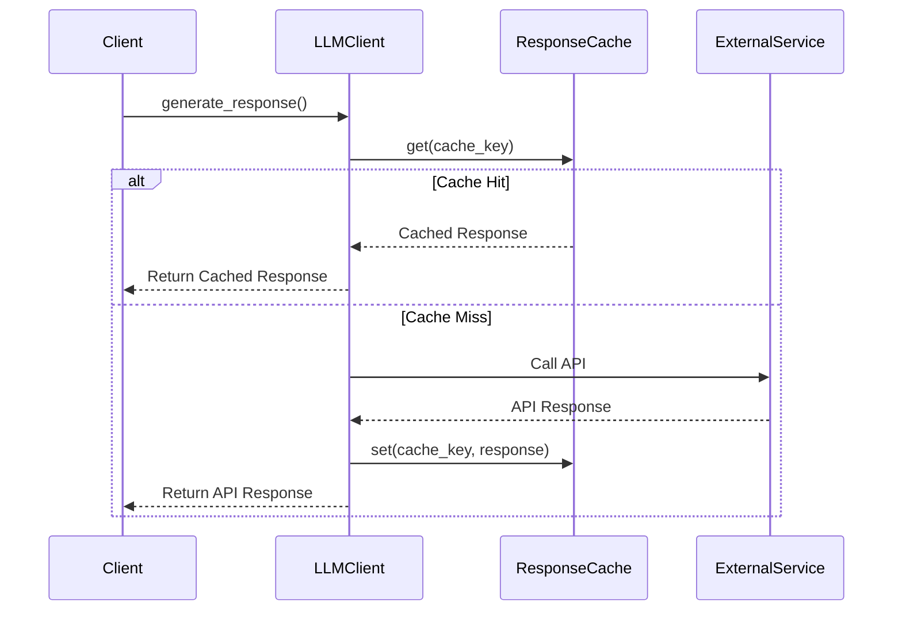

# System Patterns: Caching and Integration Implementation

## Architectural Patterns

### Caching
- Decorator/Proxy Pattern for Caching
- Implements transparent caching layer in LLM client
- Supports multiple response formats
- Configurable cache parameters

### Integration
- Modular design for API integrations
- Dependency Inversion for flexible service connections
- Consistent error handling across integrations

## Caching Mechanism

### Responsibilities

- ResponseCache: Manages cache storage and retrieval
- LLM Clients: Integrate caching logic into response generation

### Flow

1. Generate consistent cache key
2. Check cache for existing response
3. Return cached response if valid
4. Generate new response if cache miss
5. Store new response in cache

## Design Principles

- Single Responsibility Principle
- Open/Closed Principle
- Dependency Inversion
- Modularity
- Flexibility in configuration

## Configuration Management

- Dynamic configuration through config.json
- Allows runtime cache parameter adjustments
- Supports environment-specific settings
- Secure credential and configuration management

## Error Handling

- Graceful handling of cache-related errors
- Fallback to direct API call
- Comprehensive logging of cache interactions
- Detailed error reporting
- Retry mechanisms for transient errors

## Implementation Diagram

## Performance Metrics

- Reduced API calls
- Decreased response latency
- Improved system efficiency
- Minimal performance overhead
- Scalable caching mechanism

## Future Extensions

- Implement distributed caching
- Add more granular cache control
- Enhance monitoring and logging
- Support for machine learning-based cache optimization
- Advanced cache invalidation strategies
- Cross-service cache synchronization

## Integration Patterns

### API Integration
- Consistent interface for different service integrations
- Abstraction layer for API-specific complexities
- Robust error handling and logging
- Configurable retry and timeout mechanisms

### Authentication
- Secure token management
- Support for multiple authentication methods
- Automatic token refresh
- Encrypted credential storage

## Monitoring and Observability

- Comprehensive logging
- Performance metrics collection
- Error tracking and reporting
- Configurable log levels
- Integration with monitoring systems
